# Status update of the Project
The project has come to point where inferences can be drawn. With this update, the mAP measure while using the preliminary dataset and the new (elaborated) dataset has been calculated. 
Further, comments and reasons for the obtained accuracies are also provided.

Along-with this, the limitations and challenges encountered when performing object detection and segmentation in an unstructed environment are have also been looked into. 

------------
# Results with the preliminary dataset

The preliminary dataset consisted of about 140 training images and about 28 validation images. The annotations were done in a well defined manner (not very detailed). The reason for this was just to have an overview of the capabilities of Mask RCNN. The details of computations are as follows:

1. GPU - Nvidia GTX 1060 6gb
2. No. of epochs - 30
3. mAP - 15 - 17 %
4. Processing time - 15 minutes.

When comparing the predictions, original image and the annotated image, following conclusions can be drawn:

1. The model performs moderately while predicting some part of the annotated images.
2. But we can also see that in a less distinct environment (as in 4th image), the model does some wrong predictions.

---------
# Results with the elaborated dataset

The much elaborated dataset was created with around 800 training images and 140 validation images. This time, a very detailed annotation methodology was followed and a rich dataset was (attempted) to create.

The details of computation are as follows:
1. GPU - Nvidia GTX 1060
2. No. of epochs - 100
3. mAP - 25 - 27 %
4. Processing time - 2 hours.

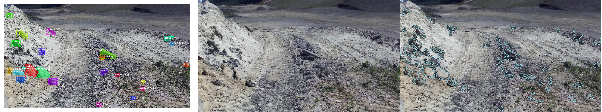
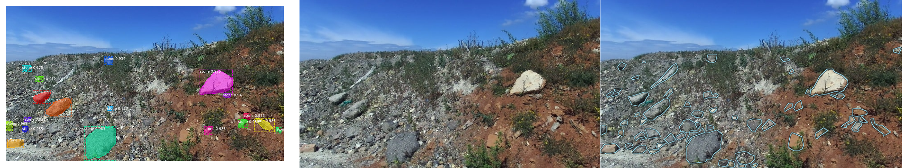
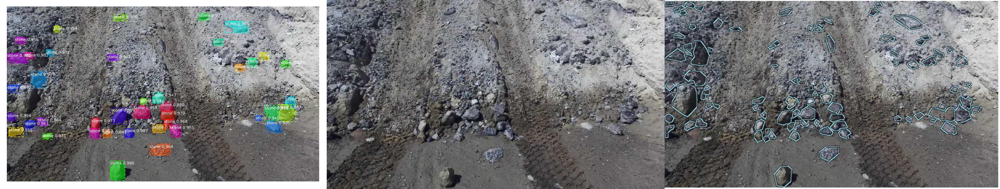
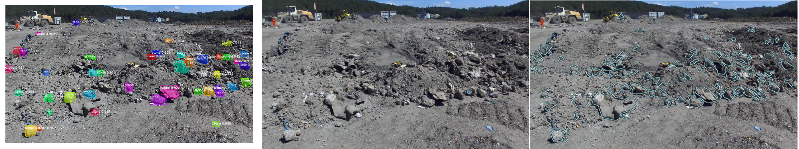
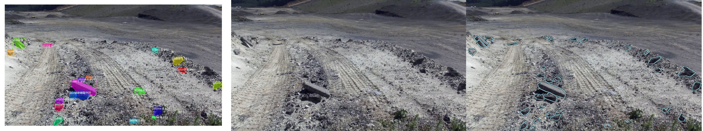

Even though, the annotations and no. of images in the dataset was increased, the model still struggles to perform as expected. 

---------

# Observations

As seen above, we can witness that the mAP of Mask RCNN was tremendously low. If we take a deeper look at the complexities involved for rock detection, various inferences can be drawn:

## Dataset Richness 
The dataset that was used during the training and testing of Mask RCNN consisted of around 1000 images that were collected during the initial phase when the project began at the Robotics lab at TU Kaiserslautern. In the dataset, the distinctiveness of rocks from the environment was not very high. Because of which, there were instances where the rocks and the background dirt were of the same colour. This would create a region of conflict and subsequently, the model would struggle to extract features from such an object.

The accuracy of the model could be increased if a huge no. of images (captured in different environments) are present in the dataset. 

## Methods of annotation
How we annotate our images also play a significant role in defining the accuracy of our model. usually, a threshold should be taken as to see what rocks can be classified as useful rocks. If we consider small rocks (stones) as useful, it would hardly make any difference when applied on a vehicle for detection. A consistency in image annotations should be followed. 

## Method of calculation of accuracy

There are many metrics which are utilised in calculation of precision of a model. The metric which is being used in Mask RCNN is mAP (https://jonathan-hui.medium.com/map-mean-average-precision-for-object-detection-45c121a31173). The Mean Average Precision has its backbone with Intersection over Union (IoU). With the obtained accuracies with Mask RCNN on our dataset, the metric seems to be unreliable. It takes into account the ratio of intersected region to the union of both the region. The issue with this method is explained further.

## Image augmentation

We all know, augmentation of images help fill the void of limited dataset (https://medium.com/@ODSC/image-augmentation-for-convolutional-neural-networks-18319e1291c). But there are instances where this fails to extract new features from the augmented image and inputs the same image to the network. 

--------

# Comparison with a dataset with distinct features

To verify whether mAP was being implemented correctly, I decided to train the network on the balloon dataset. When running the balloon dataset example, the mAP was observed to be around 81 % just after 5 epochs. 

One of the main reasons of the high mAP measure is the distinctiveness of the object (balloon) from its background.

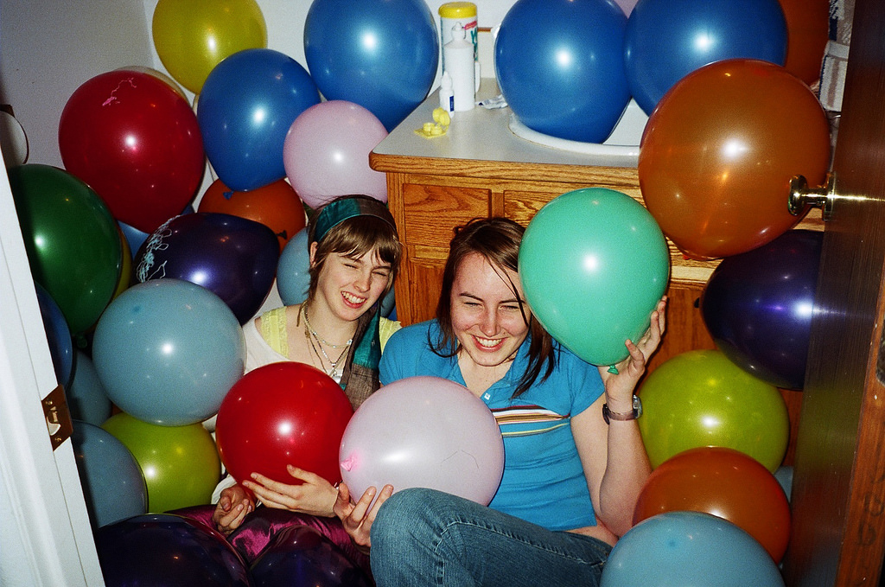

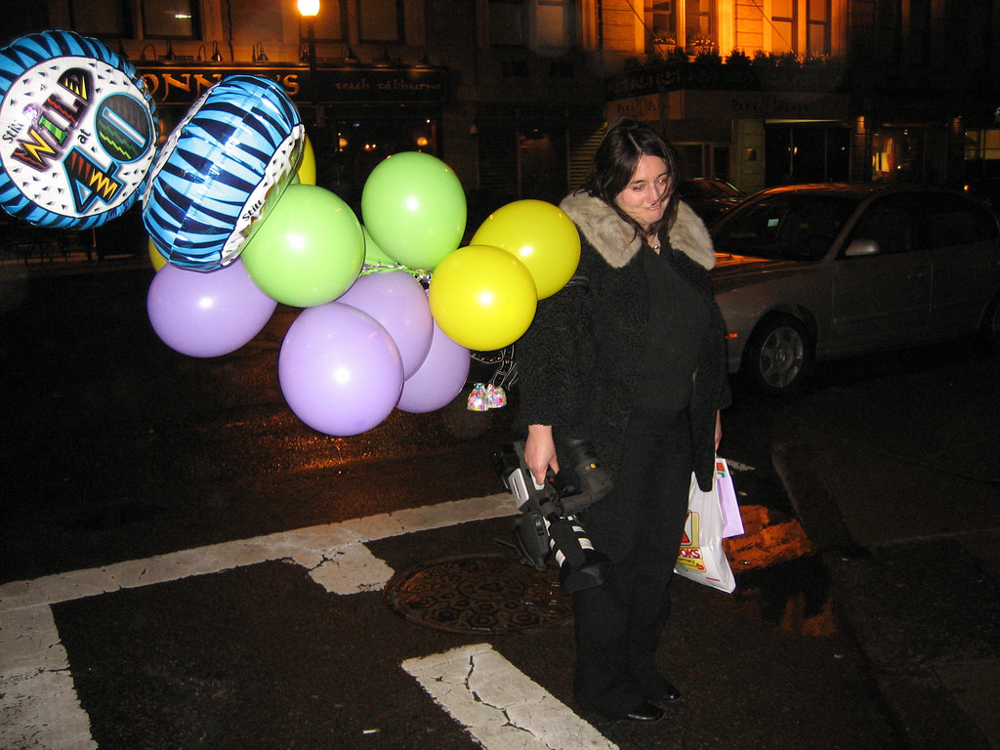

If we look at balloons, they are characterized by smooth boundaries and similarity in shapes. It is therefore, easier for a model to extract the features and learn to provide a very high mAP measure (even with less training). 

If a balloon (lets say) has a similar colour as that of its background like:

it would be very hard for the model to extract the features to distinctly characterize the object. With this, the mAP of the model would be low. 

A balloon is a synthetic object that is placed in an natural environment where it is easily distinguishable but how would the model react/adapt if it is trained on a natural object placed on a natural environment like:

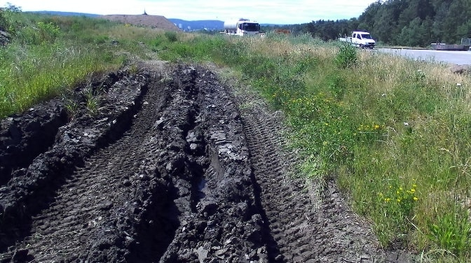
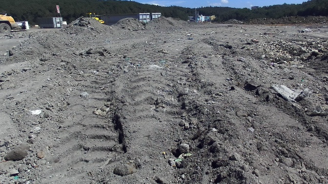

-----------------

# Complexities of the Off-Road Dataset

The case of detection of rocks in an unstructured or their natural environment is therefore a humoungous task in itself. Rocks are characterized not only by their wide variety of size and shapes such as

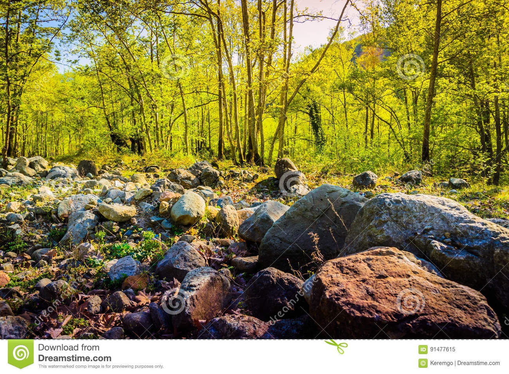 

but also by their varied textures such as 

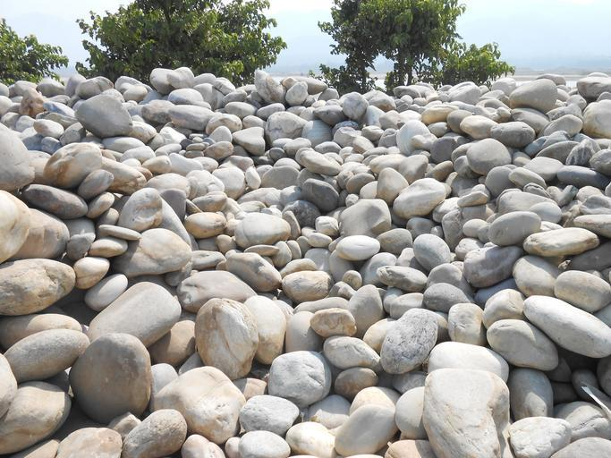

For a model to learn these many features , it must be trained on a wide variety of rich dataset. The dataset is made rich by collecting images from different terrains, under different environment conditions with proper annotations. 

If we look at our environment (especially the off-road environment), sometimes, we (humans) have difficulty identifying rocks because of complexities including:

1. The rock being camouflaged by the bushes. 
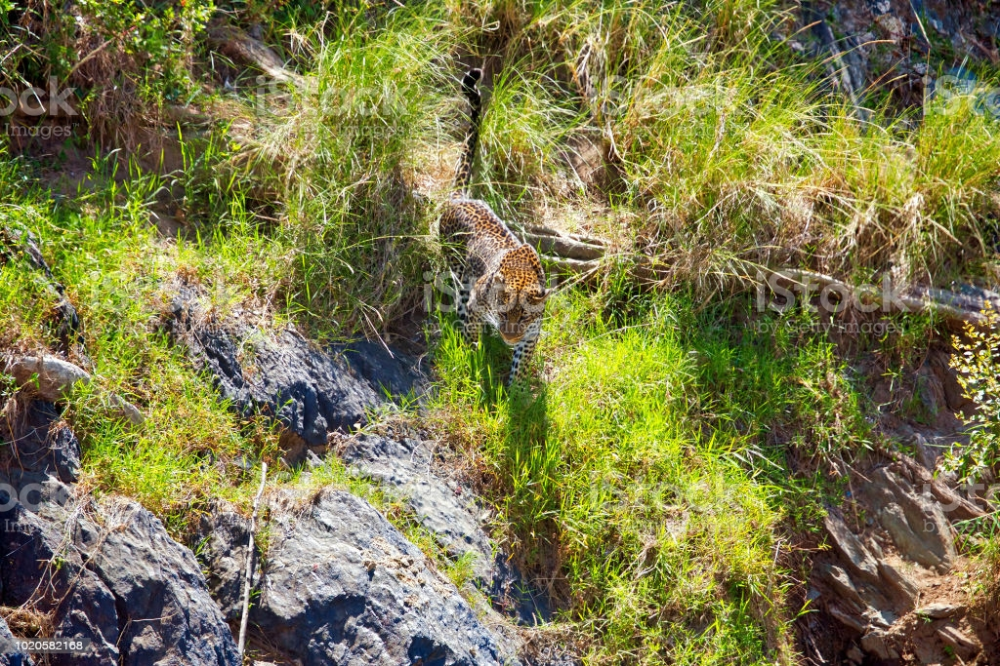
2. Environment conditions (such as rainfall) changing the appearance of a rock making it look same as that of its environment. 
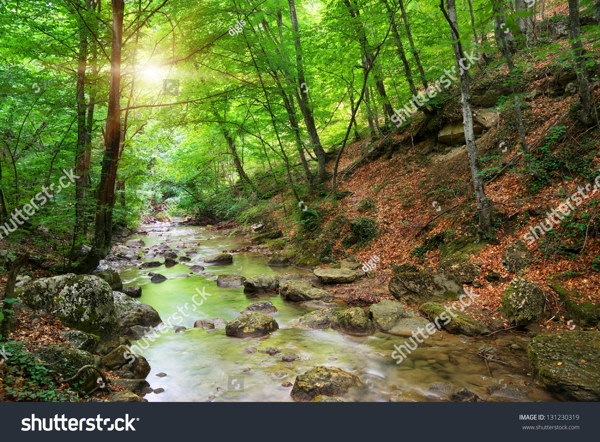 

3. Wide variety of rocks present in the environment. 
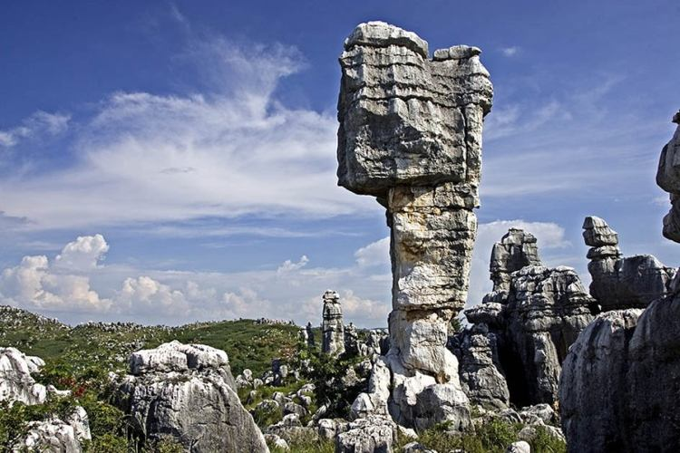

4. Changing light conditions affecting the visibility of rocks. 
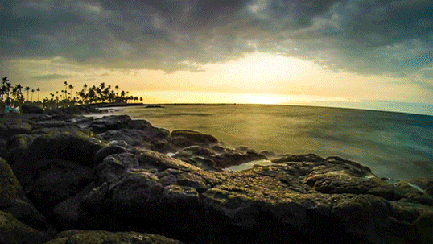

5. Sometimes, man-made objects being mis-judged as a rock. 
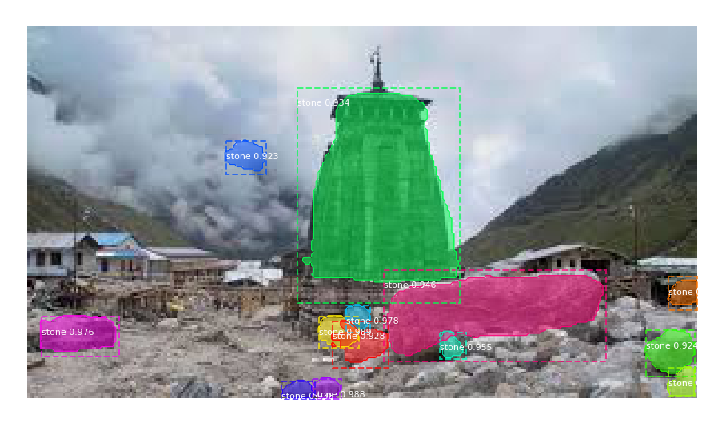

6. Improper view of the stones present underwater. 
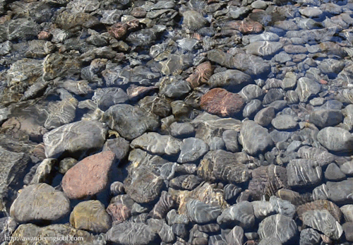

# Conclusion

1. While exploring the capabilities of Mask RCNN , it was found that it has the full capability to perform well on datasets having distinct objects.

2. The metric being used is mAP which depends upon IoU. When utilizing mAP to calculate the accuracy in the balloon dataset, very good results are obtained (around 81%). This further showcases that mAP is a very apt metric to calculate accuracy in a dataset with distinct objects.

3. But when adapting mAP to detect rocks in an off-road environment, the mAP sweeps down to a very low level of 25%-27%. If we focus on the concept of mAP, we find that it is dependent on IoU. IoU can be defined as the ratio of overlapping areas to the common area. If we focus into our results, we can see that the instances where a rock is distinctly visible from its surrounding, the prediction measure is very high (.98 to .99). But in some instances where the object is not very dintinctly separated, the model is trying to implement the learned features to predict the area which looks like a rock but in reality has not been annotated. This leads to a drop in prediction measure and in turn the mAP.

----------------------

# Limitations in Rock detection

1. One of the main limitations of implementing an object detection and segmentation model such as Mask RCNN in an off-road environment is the availability of a rich dataset. Even in most widely used datasets such as MS-COCO, ImageNet or CIFAR-10, rock class is still not defined individually. 
2. Changing environment conditions affecting the appearnace of the rocks.
3. Non-uniform shapes/boundaries of the rocks.  
4. Defining a threshold which differentiates a rock from a stone. This mainly depends on the task that has to be carried out after detecting rocks. 
5. Based on the above mentioned threshold, the annotations have to be done with consistency (which is a huge task).
6. As witnessed above, mAP is not a reliable metric to provide the accuracy score for rock detection. What other available metrics can be used to provide a good accuracy measure for rock detection ?
7. Finally, the effect of Image augmentation on the richness of the dataset could be argued upon. 

------------------------

# Final comment

Various object detection and segmentation models such as Mask RCNN perform at par in datasets with distinct objects. To adapt such models for detection of rocks in an unstructured environment would take a great deal of work because of the various complexities involved.

-----------------

